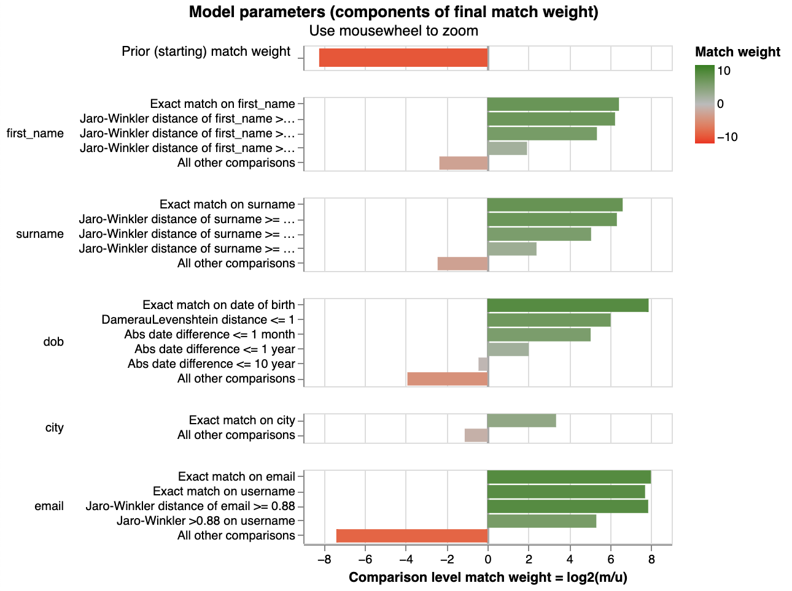
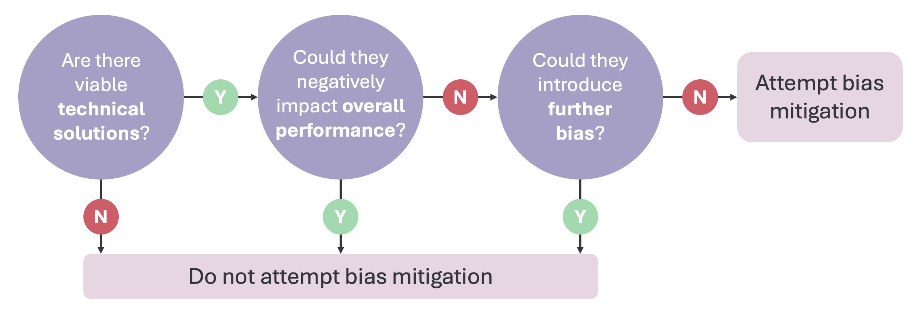

# Bias in Data Linking, continued

This blog is the second in our series dedicated to Bias in Data Linking. Here we wrap up work completed during the the six-month [Alan Turing Institute](https://www.turing.ac.uk) internship on '_Bias in Data Linking_', and share some final thoughts.

<!-- more -->

In the [previous blog post](./2024-07-11-bias.md) we concluded that assessing bias in a linkage pipeline using real data and clerical labels is possible to some degree, but has major shortcomings. Here we consider a different approach which aims to address some of these issues.

## A Different Approach

[Previously](./2024-07-11-bias.md#sources-of-bias) we established that bias in a linkage pipeline stems from two main sources: the **data** being linked and the **linkage model**. Considering both of these factors at the same time is complex, making it difficult to reach solid conclusions. Here we will explore how bias can have an impact within the **linkage model only**.

As before, we assume there is a hypothesis that we would like to explore. In order to target bias within the linkage model, we construct a synthetic dataset with combinations of records which reflect the hypothesis we wish to test.

This approach can be broken down into 5 key steps:

!!! note

    The following steps are intentionally high-level, for a more hands-on application on fake data with Splink check out the [accompanying example notebook](../../demos/examples/duckdb_no_test/bias_eval.ipynb).

## <u>1. Generate synthetic records</u>

This process builds a neutral foundation for bias detection by creating specific records to evaluate a pre-trained model's results. While the process of generating these records can vary, it's crucial to keep it controlled. Automatically generating large amounts of data without understanding the content can lead to the same issues as real production data.

Instead of focussing on the number of synthetic records, the key is ensuring each record has a clear purpose that is relevant to the hypothesis. For example, if the hypothesis is that misspellings of names lead to worse linkage, and you suspect that misspellings are more common for names of certain origins, your synthetic records might look like this:

This is a simplification, and a real generation would likely include more rows with various spelling error iterations. The final two records also consider the case of similarly spelled names relating to different individuals.

## <u>2. Investigate model parameters</u>

The pre-trained model can be analysed specifically in relation to the hypothesis, rather than just generally. In Splink, one way to do this is by using a [match weights chart](https://moj-analytical-services.github.io/splink/charts/match_weights_chart.html):

Each of the bars represent the amount of evidence (match weights) that two records refer to the same individual, depending on how similar the features are. It's useful to start thinking about how this chart relates to the scenario represented by the synthetic records. For example, for the above model there is only a significant drop in match weight for first_name between the third and fourth comparison level. 

Given the final linkage score relies on the accumulation of these match weights, viewing the model parameters in isolation like this does not give the full picture - specific examples are required.

## <u>3. Perform and evaluate linkage</u>

Now that you have records to compare and a trained model, the next stage is to generate match probabilities. If a threshold for a link has been chosen, this can be used to indicate which records would be considered to be a link in a linkage pipeline.

It's also useful to examine each comparison to see which features impact the match probability the most. In Splink, you can use a [waterfall chart](https://moj-analytical-services.github.io/splink/charts/waterfall_chart.html) for this. This will help you identify if any weights are too predictive or not predictive enough based on your hypothesis. 

Some match weights might seem off for your hypothesis but be reasonable for the [overall model](#2-investigate-model-parameters). They might not be _wrong_ per se, but if they create issues in specific scenarios, they will **introduce bias into the pipeline**.

## <u>4. Identify bias mitigations</u>

If you detect bias in the pipeline, you'll need to decide whether or not to address it. Assessing the mitigation strategy in this controlled manner ensures it directly addresses the bias.

Here's an example of how you could approach deciding whether to mitigate for bias or not:

In reality there will often be some negative impact on overall performance and/or further biases introduced by changing the model, so the decision is not straightfoward. It depends on the specific use case.

If you choose to attempt a bias mitigation, **repeat steps 1-3** before reassessing the results to determine if it was successful. Keep in mind, this attempt may only work partially - or not at all. 

## <u>5. Make a statement about bias</u>

As discussed, investigating bias should be anchored in specific hypotheses and examples and the reporting of bias within a model should follow the same structure. It is unrealistic to expect that there will be no bias at all, or that it is practical to be able to check enough hypotheses to make such a broad statement. Instead, it is recommended to report on each of the hypotheses that have been tested.

The mitigation stage can lead to three potential outcomes, each shaping a different statement about the the specific bias from your hypothesis:

1. **Bias was not detected**  
_You might disprove the hypothesis, though it's rare that there's no bias at all._

2. **Bias was detected - it has been fully mitigated**  
_It's unlikely, but possible. If this happens, ensure the impact on overall performance and any further bias is thoroughly investigated and clearly explained._

3. **Bias was detected - it has been partially/could not be mitigated**  
_This is the most likely scenario. If mitigation is partial, clearly explain where it falls short. If there's no mitigation, work to gain a more detailed understanding of the bias._

If you conclude that bias has been detected and it can only be partially mitigated or not mitigated, this is not a failure. It's a likely outcome when you're trying to standardise a pipeline that handles thousands of different scenarios with varying impacts on results.

## 💭 Final thoughts

This approach doesn’t aim to make statements about the _impact_ of the detected bias. In other words, detecting bias alone doesn’t allow you to draw conclusions on how the resulting linked data will look. This is because many other unrelated factors in the pipeline will interact with the scenarios and affect whether records are linked or not.

The goal here is to better understand bias. This is done by highlighting specific scenarios, examining how the model handles them, and introducing mitigations directly. This approach allows for more transparent statements about bias during the development of a linkage pipeline.

If you have any ideas or feedback on this process or how it's working in the notebook - **[please let us know!](https://github.com/moj-analytical-services/splink/discussions/new/choose)**