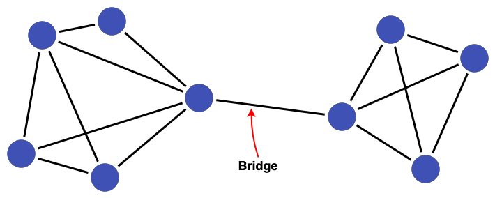
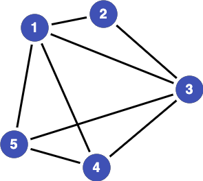

# Graph metrics

Graph metrics quantify the characteristics of a graph. A simple example of a graph metric is [cluster size](#cluster-size), which is the number of nodes within a cluster.

For data linking with Splink, it is useful to sort graph metrics into three categories:

* [Node metrics](#node-metrics)
* [Edge metrics](#edge-metrics)
* [Cluster metrics](#cluster-metrics)

Each of these are defined below together with examples and explanations of how they can be applied to linked data to evaluate cluster quality. The examples cover all metrics currently available in Splink.

!!! note

    It is important to bear in mind that whilst graph metrics can be very useful for assessing linkage quality, they are rarely definitive, especially when taken in isolation. A more comprehensive picture can be built by considering various metrics in conjunction with one another.

    It is also important to consider metrics within the context of their distribution and the underlying dataset. For example: a cluster density (see below) of 0.4 might seem low but could actually be above average for the dataset in question; a cluster of size 80 might be suspiciously large for one dataset but not for another.

## :purple_circle: Node metrics

Node metrics quantify the properties of the nodes which live within clusters.

### Node Degree

##### Definition

Node degree is the **number of edges connected to a node**.

##### Example

In the cluster below A has a node degree of 1, whereas D has a node degree of 3.

{:width="80%"}

##### Application in Data Linkage

High node degree is generally considered good as it means there are many edges in support of records in a cluster being linked. Nodes with low node degree could indicate links being missed (false negatives) or be the result of a small number of false links (false positives).

However, erroneous links (false positives) could also be the reason for _high_ node degree, so it can be useful to validate the edges of highly connected nodes.

It is important to consider [cluster size](#cluster-size) when looking at node degree. By definition, larger clusters contain more nodes to form links between, allowing nodes within them to attain higher degrees compared to those in smaller clusters. Consequently, low node degree within larger clusters can carry greater significance.

Bear in mind, that the degree of a single node in a cluster isn't necessarily representative of the overall connectedness of a cluster. This is where [cluster centralisation](#cluster-centralisation) can help.

## :link: Edge metrics

Edge metrics quantify the properties of the edges within a cluster. 

### 'is bridge'

##### Definition

An edge is classified as a 'bridge' if its **removal splits a cluster into two smaller clusters**.

##### Example

For example, the removal of the link labelled "Bridge" below would break this cluster of 9 nodes into two clusters of 5 and 4 nodes, respectively.

{:width="70%"}

##### Application in Data Linkage

Bridges can be signalers of false positives in linked data, especially when joining two highly connected sub-clusters. Examining bridges can shed light on issues with the linking process leading to the formation of false positive links.

## :fontawesome-solid-circle-nodes: Cluster metrics

Cluster metrics refer to the characteristics of a cluster as a whole, rather than the individual nodes and edges it contains.

### Cluster Size

##### Definition

Cluster size refers to the **number of nodes within a cluster**.

##### Example

The cluster below is of size 5.

{:width="30%"}

##### Application in Data Linkage

When thinking about cluster size, it is often useful to consider the biggest clusters produced and ask yourself if the sizes seem reasonable for the dataset being linked. For example when linking people, does it make sense that an individual is appearing hundreds of times in the linked data resulting in a cluster of over 100 nodes? If the answer is no, then false positives links are probably being formed.

If you don't have an intuition of what seems reasonable, then it is worth inspecting a sample of the largest clusters in Splink's [Cluster Studio Dashboard](../../../charts/cluster_studio_dashboard.ipynb) to validate (or invalidate) links. From there you can develop an understanding of what maximum cluster size to expect for your linkage. Bear in mind that a large and highly dense cluster is usually less suspicious than a large low-density cluster.

There also might be a lower bound on cluster size. For example, when linking two datasets in which you know people appear at least once in each, the minimum expected size of cluster will be 2. Clusters smaller than the minimum size indicate links have been missed.

### Cluster Density

##### Definition

The density of a cluster is given by the **number of edges it contains divided by the maximum possible number of edges**. Density ranges from 0 to 1. A density of 1 means that all nodes are connected to all other nodes in a cluster.

##### Example

The left cluster below has links between all nodes (giving a density of 1), whereas the right cluster has the minimum number of edges (4) to link 5 nodes together (giving a density of 0.4).

{:width="80%"}

##### Application in Data Linkage

When evaluating clusters, a high density (closer to 1) is generally considered good as it means there are many edges in support of the records in a cluster being linked.

A low density could indicate links being missed. A sample of low density clusters can be inspected in Splink's [Cluster Studio Dashboard](../../../charts/cluster_studio_dashboard.ipynb) via the option `sampling_method = "lowest_density_clusters_by_size"`, which performs stratified sampling across different cluster sizes. When inspecting a cluster, ask yourself the question: why aren't more links being formed between record nodes?

### Cluster Centralisation

!!! info "Work in Progress"

    We are still working out where Cluster Centralisation can be best used in the context of record linkage. At this stage, we do not have clear recommendations or guidance on the best places to use it - so if you have any expertise in this area we would love to [hear from you](https://github.com/moj-analytical-services/splink/discussions)!

    We will update this guidance as and when we have clearer strategies in this space.

##### Definition

[Cluster centralisation](https://en.wikipedia.org/wiki/Centrality#Degree_centrality) is defined as the deviation from maximum [node degree](#node-degree) normalised with respect to the maximum possible value. In other words, cluster centralisation tells us about the concentration of edges in a cluster. Centralisation ranges from 0 to 1.

##### Example

Coming Soon

##### Application in Data Linkage

A high cluster centralisation (closer to 1) indicates that a few nodes are home to significantly more connections compared to the rest of the nodes in a cluster. This can help identify clusters containing nodes with a lower number of connections (low node degree) relative to what is possible for that cluster.

Low centralisation suggests that edges are more evenly distributed amongst nodes in a cluster. This can be good if all nodes within a clusters enjoy many connections. However, low centralisation could also indicate that most nodes are not as highly connected as they could be. To check for this, look at low centralisation in conjunction with low [density](#cluster-density).

A guide on [how to compute graph metrics](./how_to_compute_metrics.ipynb) mentioned above with Splink is given in the next chapter.

Please note, this topic guide is a work in progress and we welcome any feedback.
