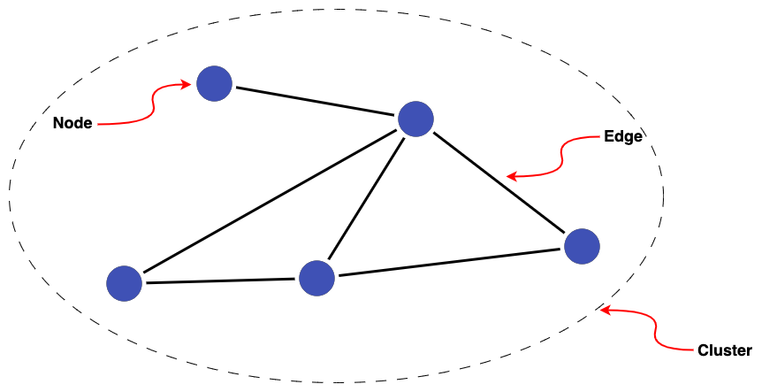

# Cluster Evaluation

Graphs provide a natural way to think about linked data (see the ["Linked data as graphs" guide](../../theory/linked_data_as_graphs.md) for a refresher). Visualising linked data as a graph and employing graph metrics are powerful ways to evaluate linkage quality.

{:width="80%"}

Graph metrics help to give a big-picture view of the clusters generated by a Splink model. Through metric distributions and statistics, we can gauge the quality of clusters and monitor how adjustments to models impact results.

Graph metrics can also help us hone in on problematic clusters, such as those containing inaccurate links (false positives). Spot-checking can be performed with Splink’s [Cluster Studio Dashboard](../../../charts/cluster_studio_dashboard.ipynb) which enables users to visualise individual clusters and interrogate the links between their member records.

## Evaluating cluster quality

### What is a high quality cluster?

When it comes to data linking, the highest quality clusters will be those containing all possible true matches (there will be no missed links a.k.a. false negatives) and no false matches (no false positives).

Generating clusters which all adhere to this ideal is rare in practice. For example,

* Blocking rules, necessary to make computations tractable, can prevent record comparisons between some true matches ever being made
* Data limitations can place an upper bound on the level of quality achievable. 

Despite this, graph metrics can help us get closer to a satisfactory level of quality as well as monitor it going forward.

### What does cluster quality look like for you?

The extent of cluster evaluation efforts and what is considered 'good enough' will vary greatly with linkage use-case. You might already have labelled data or quality assured outputs from another model which define a clear benchmark for cluster quality.

Domain knowledge can also set expectations of what is deemed reasonable or good. For example, you might already know that a large cluster (containing say 100 nodes) is suspicious for a your deduplicated dataset.

However, you may also have little or no knowledge about the data or a clear idea of what good quality clusters look like for your linkage.

Whatever the starting point, this topic guide is designed to help users develop a better understanding of their clusters and help focus quality assurance efforts to get the best out of their linkage models.

## What this topic guide contains

* An introduction to the [graph metrics](./graph_metrics.md) currently available in Splink and how to apply them to linked data
* Instructions on how to compute graph metrics with Splink

This topic guide is a work is work in progress and will be updated as new functionality and metrics are released.