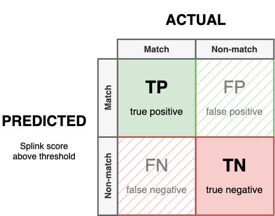
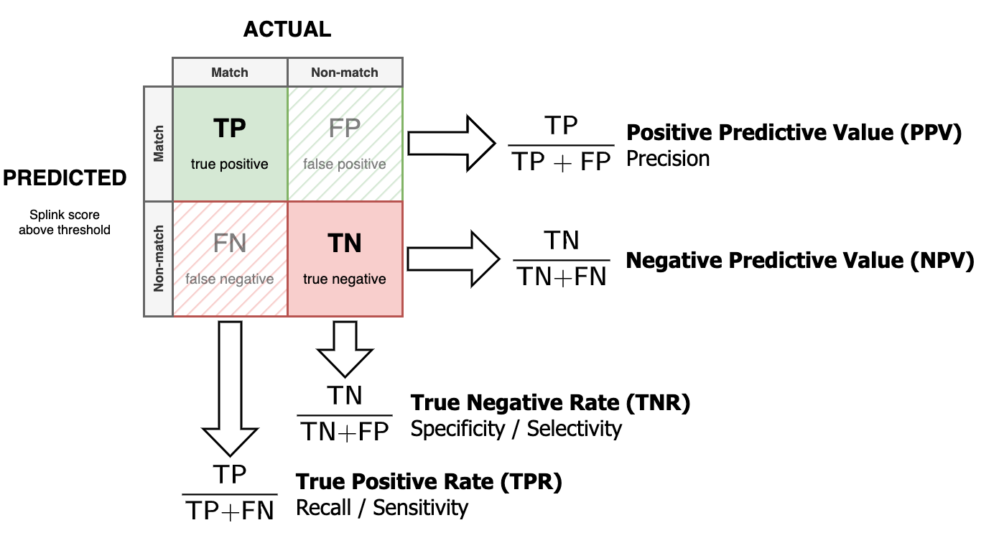

This guide is intended to be a reference guide for Edge Metrics used throughout Splink. It will build up from basic principles into more complex metrics.

!!! note
    All of these metrics are dependent on having a "ground truth" to compare against. This is generally provided by **Clerical Labelling** (i.e. labels created by a human). For more on how to generate this ground truth (and the impact that can have on Edge Metrics), check out the [Clerical Labelling Topic Guide](./labelling.md).

## The Basics

Any Edge (Link) within a Splink model will fall into one of four categories:

### True Positive

Also known as: True Link

A True Positive is a case where a Splink model correctly predicts a match between two records.

### True Negative

Also known as: True Non-link

A True Negative is a case where a Splink model correctly predicts a non-match between two records.

### False Positive

Also known as: False Link, Type I Error

A False Positive is a case where a Splink model incorrectly predicts a match between two records, when they are actually a non-match.

### False Negative

Also known as: False Non-link, Missed Link, Type II Error

A False Negative is a case where a Splink model incorrectly predicts a non-match between two records, when they are actually a match.

### Confusion Matrix
These can be summarised in a Confusion Matrix

{:style="width:600px"}

In a perfect model there would be no False Positives or False Negatives (i.e. FP = 0 and FN = 0).

??? info "Confusion Matrix in Splink"

    For a more in-depth guide on how to use the Splink Confusion Matrix, check out the `confusion_matrix_from_labels_table` [API documentation](../../linker.md#splink.linker.Linker.confusion_matrix_from_labels_table) and [Chart Gallery](../../charts/confusion_matrix_from_labels_table.ipynb).

## Metrics for Linkage

The confusion matrix shows **counts** of each link type, but we are generally more interested in **proportions**. I.e. what percentage of the time does the model get the answer right?

### Accuracy

The simplest metric is 

$$\textsf{Accuracy} = \frac{\textsf{True Positives}+\textsf{True Negatives}}{\textsf{All Predictions}}$$

This measures the proportion of correct classifications (of any kind). This may be useful for balanced data but high accuracy can be achieved by simply assuming the majority class for highly imbalanced data (e.g. assuming non-matches).

??? info "Accuracy in Splink"

    - Accuracy is a (non-default) output of `accuracy_chart_from_labels_table` check out the [API Documentation](../../linker.md#splink.linker.Linker.accuracy_chart_from_labels_table) and [Chart Gallery](../../charts/accuracy_chart_from_labels_table.ipynb) to learn more.
    - Accuracy can be calculated and output in tabular format in Splink using labels as a column in your linking datasets, or labels as a separate table. To try this yourself, check out the [`truth_space_table_from_labels_column`](https://moj-analytical-services.github.io/splink/linkerqa.html#splink.linker.Linker.truth_space_table_from_labels_column)
    and [`truth_space_table_from_labels_table`](https://moj-analytical-services.github.io/splink/linkerqa.html#splink.linker.Linker.truth_space_table_from_labels_table) methods, respectively.

### True Positive Rate (Recall)

Also known as: **Sensitivity**

The True Positve Rate (Recall) is the proportion of matches that are correctly predicted by Splink.

$$\textsf{Recall} = \frac{\textsf{True Positives}}{\textsf{All Positives}} = \frac{\textsf{True Positives}}{\textsf{True Positives} + \textsf{False Negatives}}$$

??? info "Recall in Splink"

    - Recall is a (default) output of `accuracy_chart_from_labels_table` check out the [API Documentation](../../linker.md#splink.linker.Linker.accuracy_chart_from_labels_table) and [Chart Gallery](../../charts/accuracy_chart_from_labels_table.ipynb) to learn more.
    - Recall can be calculated and output in tabular format in Splink using labels as a column in your linking datasets, or labels as a separate table. To try this yourself, check out the [`truth_space_table_from_labels_column`](https://moj-analytical-services.github.io/splink/linkerqa.html#splink.linker.Linker.truth_space_table_from_labels_column)
    and [`truth_space_table_from_labels_table`](https://moj-analytical-services.github.io/splink/linkerqa.html#splink.linker.Linker.truth_space_table_from_labels_table) methods, respectively.
    - The interaction between Precision and Recall can be viewed with the `precision_recall_chart_from_labels_table` method. Check out the [API Documantation](../../linker.md#precision_recall_chart_from_labels_table) and [Chart Gallery](../../charts/precision_recall_chart_from_labels_table.ipynb) to learn more.
    - Recall is used to as part of estimating the probablility thay two random records match. This value is then used as a baseline to which all addtional evidence from features in your model is added to produce a final Splink score. For further information, checkout the [estimate_probability_two_random_records_match](https://moj-analytical-services.github.io/splink/linker.html?h=recall#splink.linker.Linker.estimate_probability_two_random_records_match) API Documentation and the Model Training Topic Guide (Coming soon).

### True Negative Rate (Specificity)

Also known as: **Selectivity**

The True Negative Rate (Specificity) is the proportion of non-matches that are correctly predicted by Splink.

$$\textsf{Specificity} = \frac{\textsf{True Negatives}}{\textsf{All Negatives}} = \frac{\textsf{True Negatives}}{\textsf{True Negatives} + \textsf{False Positives}}$$

??? info "Specificity in Splink"

    - Specificity is a (non-default) output of `accuracy_chart_from_labels_table` check out the [API Documentation](../../linker.md#splink.linker.Linker.accuracy_chart_from_labels_table) and [Chart Gallery](../../charts/accuracy_chart_from_labels_table.ipynb) to learn more.
    - Specificity can be calculated and output in tabular format in Splink using labels as a column in your linking datasets, or labels as a separate table. To try this yourself, check out the [`truth_space_table_from_labels_column`](https://moj-analytical-services.github.io/splink/linkerqa.html#splink.linker.Linker.truth_space_table_from_labels_column)
    and [`truth_space_table_from_labels_table`](https://moj-analytical-services.github.io/splink/linkerqa.html#splink.linker.Linker.truth_space_table_from_labels_table) methods, respectively.

### Positive Predictive Value (Precision)

The Positive Predictive Value (Precision), is the proportion of predicted matches which are true matches.

$$\textsf{Precision} = \frac{\textsf{True Positives}}{\textsf{All Predicted Positives}} = \frac{\textsf{True Positives}}{\textsf{True Positives} + \textsf{False Negatives}}$$

??? info "Precision in Splink"

    - Precision is a (default) output of `accuracy_chart_from_labels_table` check out the [API Documentation](../../linker.md#splink.linker.Linker.accuracy_chart_from_labels_table) and [Chart Gallery](../../charts/accuracy_chart_from_labels_table.ipynb) to learn more.
    - Precision can be calculated and output in tabular format in Splink using labels as a column in your linking datasets, or labels as a separate table. To try this yourself, check out the [`truth_space_table_from_labels_column`](https://moj-analytical-services.github.io/splink/linkerqa.html#splink.linker.Linker.truth_space_table_from_labels_column)
    and [`truth_space_table_from_labels_table`](https://moj-analytical-services.github.io/splink/linkerqa.html#splink.linker.Linker.truth_space_table_from_labels_table) methods, respectively.
    - The interaction between Precision and Recall can be viewed with the `precision_recall_chart_from_labels_table` method. Check out the [API Documantation](../../linker.md#precision_recall_chart_from_labels_table) and [Chart Gallery](../../charts/precision_recall_chart_from_labels_table.ipynb) to learn more.

### Negative Predictive Value

The Negative Predictive Value is the proportion of predicted non-matches which are true non-matches.

$$\textsf{Negative Predictive Value} = \frac{\textsf{True Negatives}}{\textsf{All Predicted Negatives}} = \frac{\textsf{True Negatives}}{\textsf{True Negatives} + \textsf{False Positives}}$$

??? info "Negative Predicitive Value in Splink"

    - Negative Predictive Value is a (non-default) output of `accuracy_chart_from_labels_table` check out the [API Documentation](../../linker.md#splink.linker.Linker.accuracy_chart_from_labels_table) and [Chart Gallery](../../charts/accuracy_chart_from_labels_table.ipynb) to learn more.
    - Negative Predictive Value can be calculated and output in tabular format in Splink using labels as a column in your linking datasets, or labels as a separate table. To try this yourself, check out the [`truth_space_table_from_labels_column`](https://moj-analytical-services.github.io/splink/linkerqa.html#splink.linker.Linker.truth_space_table_from_labels_column)
    and [`truth_space_table_from_labels_table`](https://moj-analytical-services.github.io/splink/linkerqa.html#splink.linker.Linker.truth_space_table_from_labels_table) methods, respectively.

!!! warning 

    Each of these metrics looks at just one row or column of the confusion matrix. A model cannot be meaningfully summarised by just one of these performance measures.

    **“Predicts cancer with 100% Precision”** - is true of a “model” that correctly identifies one known cancer patient, but misdiagnoses everyone else as cancer-free.

    **“AI judge’s verdicts have Recall of 100%”** - is true for a power-mad AI judge that declares everyone guilty, regardless of any evidence to the contrary.

## Composite Metrics for Linkage

This section contains composite metrics i.e. combinations of metrics that can been derived from the confusion matrix (Precision, Recall, Specificity and Negative Predictive Value). 

Any comparison of two records has a number of possible outcomes (True Positives, False Positives etc.), each of which has a different impact on your specific use case. It is very rare that a single metric defines the desired behaviour of a model. Therefore, evaluating performance with a composite metric (or a combination of metrics) is advised.

### F Score

The [F-Score](https://en.wikipedia.org/wiki/F-score) is a weighted harmonic mean of Precision (Positive Predictive Value) and Recall (True Positive Rate). For a general weight $\beta$:

$$F_{\beta} = \frac{(1 + \beta^2) \cdot \textsf{Precision} \cdot \textsf{Recall}}{\beta^2 \cdot \textsf{Precision} + \textsf{Recall}}$$

where Recall is $\beta$ times more important than Precision.

For example, when Precision and Recall are equally weighted ($\beta = 1$), we get:

$$F_{1} = 2\left[\frac{1}{\textsf{Precision}}+\frac{1}{\textsf{Recall}}\right]^{-1} = \frac{2 \cdot \textsf{Precision} \cdot \textsf{Recall}}{\textsf{Precision} + \textsf{Recall}}$$

Other popular versions of the F score are $F_{2}$ (Recall twice as important as Precision) and $F_{0.5}$ (Precision twice as important as Recall)

??? info "F-Score in Splink"

    - F-Score is a (non-default) output of `accuracy_chart_from_labels_table`. There is the option to include $F_{1}$, $F_{0.5}$ and $F_{2}$ scores. Check out the [API Documentation](../../linker.md#splink.linker.Linker.accuracy_chart_from_labels_table) and [Chart Gallery](../../charts/accuracy_chart_from_labels_table.ipynb) to learn more.
    - F-Scores ($F_{1}$, $F_{0.5}$ and $F_{2}$) can be calculated and output in tabular format in Splink using labels as a column in your linking datasets, or labels as a separate table. To try this yourself, check out the [`truth_space_table_from_labels_column`](https://moj-analytical-services.github.io/splink/linkerqa.html#splink.linker.Linker.truth_space_table_from_labels_column)
    and [`truth_space_table_from_labels_table`](https://moj-analytical-services.github.io/splink/linkerqa.html#splink.linker.Linker.truth_space_table_from_labels_table) methods, respectively.

!!! warning

    F-score does not account for class imbalance in the data, and is asymmetric (i.e. it considers the prediction of matching records, but ignores how well the model correctly predicts non-matching records).

### P4 Score

The [$P_{4}$ Score](https://en.wikipedia.org/wiki/P4-metric) is the harmonic mean of the 4 metrics that can be directly derived from the confusion matric:

$$ 4\left[\frac{1}{\textsf{Recall}}+\frac{1}{\textsf{Specificity}}+\frac{1}{\textsf{Precision}}+\frac{1}{\textsf{Negative Predictive Value}}\right]^{-1} $$

This addresses one of the issues with the F-Score as it considers how well the model predicts non-matching records as well as matching records.

Note: all metrics are given equal weighting.

??? info "$P_{4}$ in Splink"

    - $P_{4}$ is a (non-default) output of `accuracy_chart_from_labels_table` check out the [API Documentation](../../linker.md#splink.linker.Linker.accuracy_chart_from_labels_table) and [Chart Gallery](../../charts/accuracy_chart_from_labels_table.ipynb) to learn more.
    - $P_{4}$ can be calculated and output in tabular format in Splink using labels as a column in your linking datasets, or labels as a separate table. To try this yourself, check out the [`truth_space_table_from_labels_column`](https://moj-analytical-services.github.io/splink/linkerqa.html#splink.linker.Linker.truth_space_table_from_labels_column)
    and [`truth_space_table_from_labels_table`](https://moj-analytical-services.github.io/splink/linkerqa.html#splink.linker.Linker.truth_space_table_from_labels_table) methods, respectively.

### Matthews Correlation Coefficient 

The [Matthews Correlation Coefficient ($\phi$)](https://en.wikipedia.org/wiki/Phi_coefficient) is a measure of how correlation between predictions and actual observations.

$$ \phi = \sqrt{\textsf{Recall} \cdot \textsf{Specificity} \cdot \textsf{Precision} \cdot \textsf{Negative Predictive Value}} - \sqrt{(1 - \textsf{Recall})(1 - \textsf{Specificity})(1 - \textsf{Precision})(1 - \textsf{Negative Predictive Value})} $$

??? info "Matthews Correlation Coefficient ($\phi$) in Splink"

    
    - $\phi$ is a (non-default) output of `accuracy_chart_from_labels_table` check out the [API Documentation](../../linker.md#splink.linker.Linker.accuracy_chart_from_labels_table) and [Chart Gallery](../../charts/accuracy_chart_from_labels_table.ipynb) to learn more.
    - $\phi$ can be calculated and output in tabular format in Splink using labels as a column in your linking datasets, or labels as a separate table. To try this yourself, check out the [`truth_space_table_from_labels_column`](https://moj-analytical-services.github.io/splink/linkerqa.html#splink.linker.Linker.truth_space_table_from_labels_column)
    and [`truth_space_table_from_labels_table`](https://moj-analytical-services.github.io/splink/linkerqa.html#splink.linker.Linker.truth_space_table_from_labels_table) methods, respectively.

!!! note

    Unlike the other metrics in this guide, $\phi$ is a correlation coefficient, so can range from -1 to 1 (as opposed to a range of 0 to 1).

    In reality, linkage models should never be negatively correlated with actual observations, so $\phi$ can be used in the same way as other metrics.