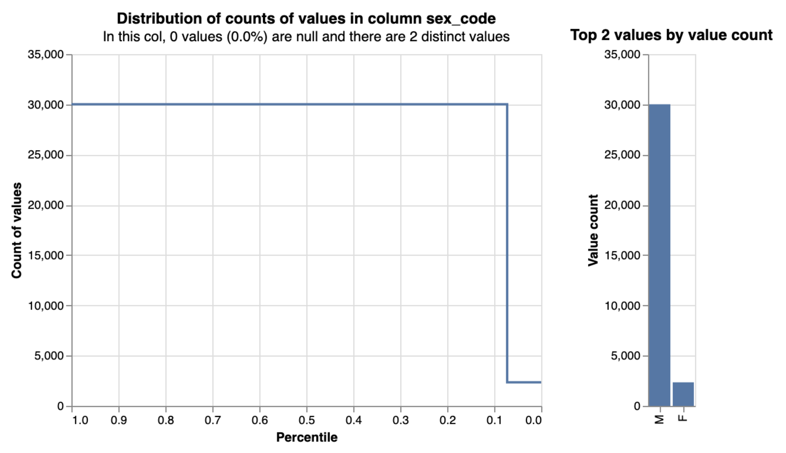
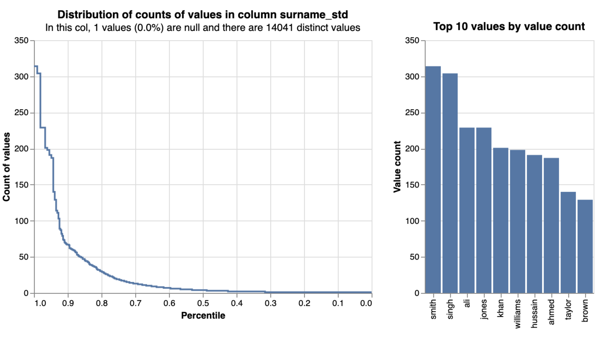
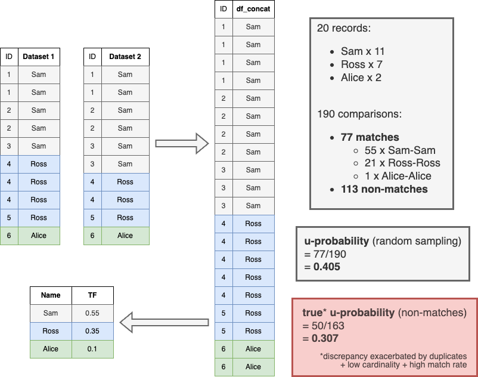
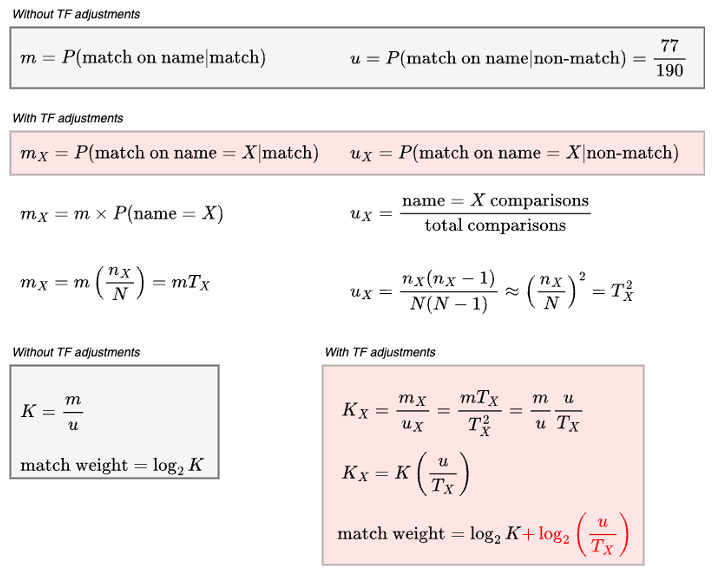
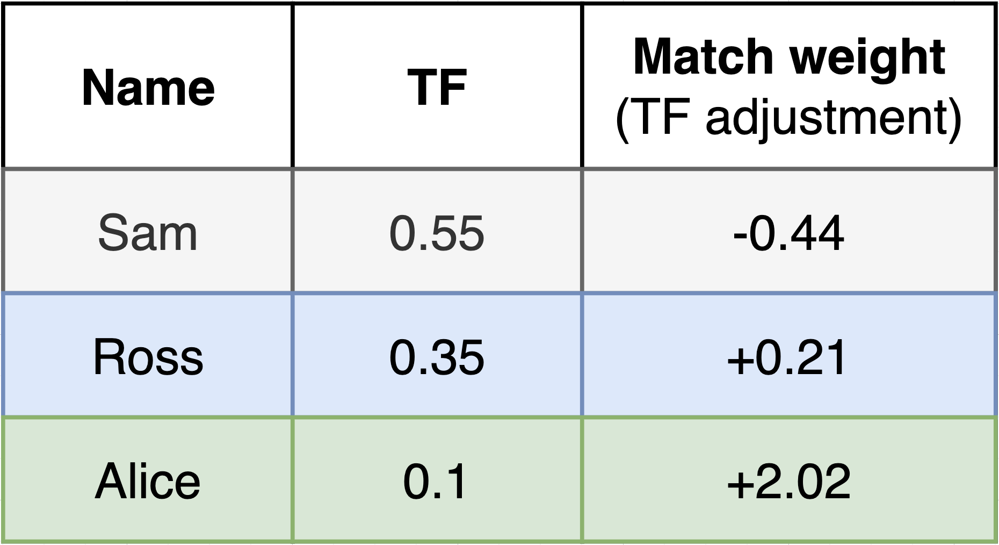

# Term-Frequency Adjustments

## Problem Statement

A common shortcoming of the Fellegi-Sunter model is that it doesn’t account for skew in the distributions of linking variables. One of the starkest examples is a binary variable such as gender in the prison population, where male offenders outnumber female offenders by 10:1. 



#### How does this affect our m and u probabilities? 

- m probability is unaffected - given two records are a match, the gender field should also match with roughly the same probability for males and females

- Given two records are not a match, however, it is far more likely that both records will be male than that they will both be female - u probability is too low for the more common value (male) and too high otherwise. 

In this example, one solution might be to create an extra comparison level for matches on gender:

- `l.gender = r.gender AND l.gender = 'Male'`

- `l.gender = r.gender AND l.gender = 'Female'`

However, this complexity forces us to estimate two m probabilities when one would do, and it becomes impractical if we extend to higher-cardinality variables like surname, requiring thousands of additional comparison levels.



This problem used to be addressed with an ex-post (after the fact) solution - once the linking is done, we have a look at the average match probability for each value in a column to determine which values tend to be stronger indicators of a match. If the average match probability for records pairs that share a surname is 0.2 but the average for the specific surname Smith is 0.1 then we know that the match weight for name should be adjusted downwards for Smiths. 

The shortcoming of this option is that in practice, the model training is conducted on the assumption that all name matches are equally informative, and all of the underlying probabilities are evaluated accordingly. Ideally, we want to be able to account for term frequencies within the Fellegi-Sunter framework as trained by the EM algorithm. 

## Toy Example

Below is an illustration of 2 datasets (10 records each) with skewed distributions of **first name**. A `link_and_dedupe` Splink model concatenates these two tables and deduplicates those 20 records.



In principle, u probabilities for a small dataset like this can be estimated directly - out of 190 possible pairwise comparisons, 77 of them have the same **first name**. Based on the assumption that matches are rare (i.e. the vast majority of these comparisons are non-matches), we use this as a direct estimate of u. Random sampling makes the same assumption, but by using a manageable-sized sample of a much larger dataset where it would be prohibitively costly to perform all possible comparisons (a Cartesian join).

Once we have concatenated our input tables, it is useful to calculate the term frequencies (TF) of each value. Rather than keep a separate TF table, we can add a TF column to the concatenated table - this is what `df_concat_with_tf` refers to within Splink.

Building on the example above, we can define the m and u probabilities for a specific **first name** value, and work out an expression for the resulting match weight.



Just as we can add independent match weights for **name**, **DOB** and other comparisons (as shown in the Splink waterfall charts), we can also add an independent TF adjustment term for each comparison. This is useful because:

- The TF adjustment doesn't depend on m, and therefore does not have to be estimated by the EM algorithm - it is known already

- The EM algorithm benefits from the TF adjustment (rather than previous post hoc implementations)

- It is trivially easy to “turn off” TF adjustments in our final match weights if we wish

- We can easily disentangle and visualise the aggregate significance of a particular column, separately from the deviations within it (see charts below)



## Visualising TF Adjustments

For an individual comparison of two records, we can see the impact of TF adjustments in the waterfall charts:


We can also see these match weights and TF adjustments summarised using a chart like the below to highlight common and uncommon names. We do this already using the Splink linker's profile_columns method, but once we know the u probabilities for our comparison columns, we can show these outliers in terms of their impact on match weight:


Creating a function to generate this chart of term-frequency-adjusted match weights is currently on our backlog. If you thing this would be useful please comment on the [github issue](https://github.com/moj-analytical-services/splink/issues/430) or feel free to put in a PR. We love getting contributions from our users!


## Applying TF adjustments in Splink

Depending on how you compose your Splink settings, TF adjustments can be applied to a specific comparison level in different ways:

### Comparison (template) library functions

```
import splink.duckdb.duckdb_comparison_library as cl
import splink.duckdb.duckdb_comparison_template_library as ctl

sex_comparison = cl.exact_match("sex", 
  term_frequency_adjustments = True
)

name_comparison = cl.distance_function_at_thresholds("name",
  distance_function_name = 'jaccard',
  distance_threshold_or_thresholds = [0.9, 0.7],
  term_frequency_adjustments = True
)

dob_comparison = ctl.date_comparison("date_of_birth", 
  term_frequency_adjustments = True
)
```

### Comparison level library functions

```
import splink.duckdb.duckdb_comparison_level_library as cll

name_comparison = {
    "output_column_name": "name",
    "comparison_description": "Full name",
    "comparison_levels": [
        cll.null_level("full_name"),
        cll.exact_match_level("full_name", term_frequency_adjustments = True),
        cll.columns_reversed_level("first_name", "surname", 
          tf_adjustment_column = "surname"
        ),
        cll.else_level(),
    ],
}
```

### Providing a detailed spec as a dictionary

```
comparison_first_name = {
    "output_column_name": "first_name",
    "comparison_description": "First name jaro dmeta",
    "comparison_levels": [
        {
            "sql_condition": "first_name_l IS NULL OR first_name_r IS NULL",
            "label_for_charts": "Null",
            "is_null_level": True,
        },
        {
            "sql_condition": "first_name_l = first_name_r",
            "label_for_charts": "Exact match",
            "tf_adjustment_column": "first_name",
            "tf_adjustment_weight": 1.0,
            "tf_minimum_u_value": 0.001,
        },
        {
            "sql_condition": "jaro_winkler_sim(first_name_l, first_name_r) > 0.8",
            "label_for_charts": "Exact match",
            "tf_adjustment_column": "first_name",
            "tf_adjustment_weight": 0.5,
            "tf_minimum_u_value": 0.001,
        },
        {"sql_condition": "ELSE", "label_for_charts": "All other comparisons"},
    ],
}
```

## More advanced applications

The code examples above show how we can use term frequencies for different columns for different comparison levels, and demonstrated a few other features of the TF adjustment implementation in Splink:

### Multiple columns

Each comparison level can be adjusted on the basis of a specified column. In the case of exact match levels, this is trivial but it allows some partial matches to be reframed as exact matches on a different derived column. 
One example could be **ethnicity**, often provided in codes as a letter (W/M/B/A/O - the ethnic group) and a number. Without TF adjustments, an ethnicity comparison might have 3 levels - exact match, match on ethnic group (`LEFT(ethnicity,1)`), no match. By creating a derived column `ethnic_group = LEFT(ethnicity,1)` we can apply TF adjustments to both levels.

```
ethnicity_comparison = {
    "output_column_name": "ethnicity",
    "comparison_description": "Self-defined ethnicity",
    "comparison_levels": [
        cll.null_level("ethnicity"),
        cll.exact_match_level("ethnicity", term_frequency_adjustments = True),
        cll.exact_match_level("ethnic_group", term_frequency_adjustments = True),
        cll.else_level(),
    ],
}
```

A more critical example would be a **full name** comparison that uses separate **first name** and **surname** columns. Previous implementations would apply TF adjustments to each name component independently, so “John Smith” would be adjusted down for the common name “John” and then again for the common name “Smith”. However, the frequencies of names are not generally independent (e.g. “Mohammed Khan” is a relatively common full name despite neither name occurring frequently). A simple full name comparison could therefore be structured as follows:

```
name_comparison = {
    "output_column_name": "name",
    "comparison_description": "Full name",
    "comparison_levels": [
        cll.null_level("full_name"),
        cll.exact_match_level("full_name", term_frequency_adjustments = True),
        cll.exact_match_level("first_name", term_frequency_adjustments = True),
        cll.exact_match_level("surname", term_frequency_adjustments = True),
        cll.else_level(),
    ],
}
```

### Fuzzy matches

All of the above discussion of TF adjustments has assumed an exact match on the column in question, but this need not be the case. Where we have a “fuzzy” match between string values, it is generally assumed that there has been some small corruption in the text, for a number of possible reasons. A trivial example could be `"Smith"` vs `"Smith "` which we know to be equivalent if not an exact string match.

In the case of a fuzzy match, we may decide it is desirable to apply TF adjustments for the same reasons as an exact match, but given there are now two distinct sides to the comparison, there are also two different TF adjustments. Building on our assumption that one side is the “correct” or standard value and the other contains some mistake, Splink will simply use the greater of the two term frequencies. There should be more `"Smith"`s than `"Smith "`s, so the former provides the best estimate of the true prevalence of the name Smith in the data. 

In cases where this assumption might not hold and both values are valid and distinct (e.g. `"Alex"` v `"Alexa"`), this behaviour is still desirable. Taking the most common of the two ensures that we err on the side of lowering the match score for a more common name than increasing the score by assuming the less common name.  

TF adjustments will not be applied to any comparison level without explicitly being turned on, but to allow for some middle ground when applying them to fuzzy match column, there is a `tf_adjustment_weight` setting that can down-weight the TF adjustment. A weight of zero is equivalent to turning TF adjustments off, while a weight of 0.5 means the match weights are halved, mitigating their impact:

```
{
  "sql_condition": "jaro_winkler_sim(first_name_l, first_name_r) > 0.8",
  "label_for_charts": "Exact match",
  "tf_adjustment_column": "first_name",
  "tf_adjustment_weight": 0.5
}
```

### Low-frequency outliers

Another example of where you may wish to limit the impact of TF adjustments is for exceedingly rare values. As defined above, the TF-adjusted match weight, K is inversely proportional to the term frequency, allowing K to become very large in some cases. 

Let’s say we have a handful of records with the misspelt first name “Siohban” (rather than “Siobhan”). Fuzzy matches between the two spellings will rightly be adjusted on the basis of the frequency of the correct spelling, but there will be a small number of cases where the misspellings match one another. Given we suspect these values are more likely to be misspellings of more common names, rather than a distinct and very rare name, we can mitigate this effect by imposing a minimum value on the term frequency used (equivalent to the u value). This can be added to your full settings dictionary as in the example above using `"tf_minimum_u_value": 0.001`. This means that for values with a frequency of <1 in 1000, it will be set to 0.001.